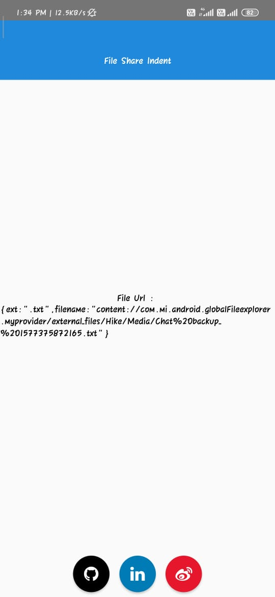

# react-native-file-share-for-android

`react-native-file-share-for-android` which helps to share files, videos, photos etc into react-native apps. you can use this package via installing the npm package

## Example

Clone this example folder https://github.com/BalaRajendran/React-native-file-share-for-android and run in your local system

```sh
git clone https://github.com/BalaRajendran/React-native-file-share-for-android
npm install
react-native run-android
```

## Getting started

`$ npm install react-native-file-share-for-android --save`

### Mostly automatic installation

`$ react-native link react-native-file-share-for-android`

### Manual installation

#### iOS

Package not supported in IOS

#### Android

1. Open up `android/app/src/main/java/[...]/MainActivity.java`

- Add `import com.ReactNativeFileShareForAndroid.ReactNativeFileShareForAndroidPackage;` to the imports at the top of the file
- Add `new ReactNativeFileShareForAndroidPackage()` to the list returned by the `getPackages()` method

2. Append the following lines to `android/settings.gradle`:

   ```
   include ':react-native-file-share-for-android'
   project(':react-native-file-share-for-android').projectDir = new File(rootProject.projectDir, 	'../node_modules/react-native-file-share-for-android/android')
   ```

3. In `android/app/src/main/AndroidManifest.xml` in <activity>

   - Add MIME Type which you want to support in your app

   ```
   <activity
   ...
   >
   ...
      <intent-filter>
      <action android:name="android.intent.action.SEND" />
      <category android:name="android.intent.category.DEFAULT" />
      <data android:mimeType="*/*" /> //It can accept everything
      </intent-filter>
   </activity>
   ```

   - Some of the Specific Mime Types are:

   ```
   <data android:mimeType="text/plain" />
   <data android:mimeType="image/*" />
   <data android:mimeType="application/*" />
   <data android:mimeType="video/*" />
   ```

4. Insert the following lines inside the dependencies block in `android/app/build.gradle`

```
  implementation project(':react-native-file-share-for-android')
```

## Issues

If you are facing any issues, create Issues in Repository

## preview

click to play preview

[](https://youtu.be/fjPl_MtaaYo)

## Usage

```javascript
import React, { Component } from "react";
import { View, Text } from "react-native";
import ReactNativeFileShareForAndroid from "react-native-file-share-for-android";

export default class App extends Component {
  constructor(props) {
    super(props);
    this.state = {
      url: ""
    };
  }

  componentDidMount() {
    if (ReactNativeFileShareForAndroid) {
      ReactNativeFileShareForAndroid.getFilepath(url => {
        this.setState({ url });
      });
    }
  }

  render() {
    return (
      <View>
        <Text>File Url : </Text>
        <Text>{this.state.url}</Text>
      </View>
    );
  }
}

RNReactNativeFileShareForAndroid;
```
